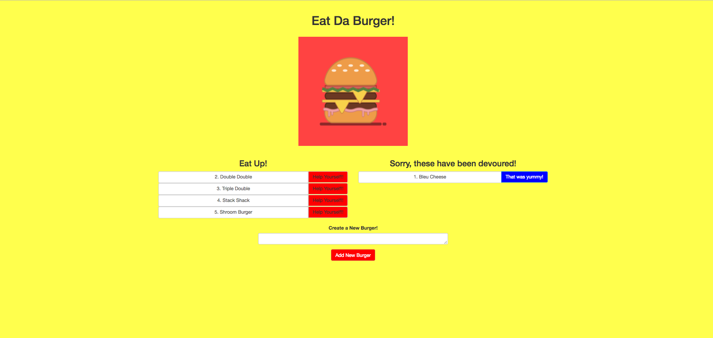
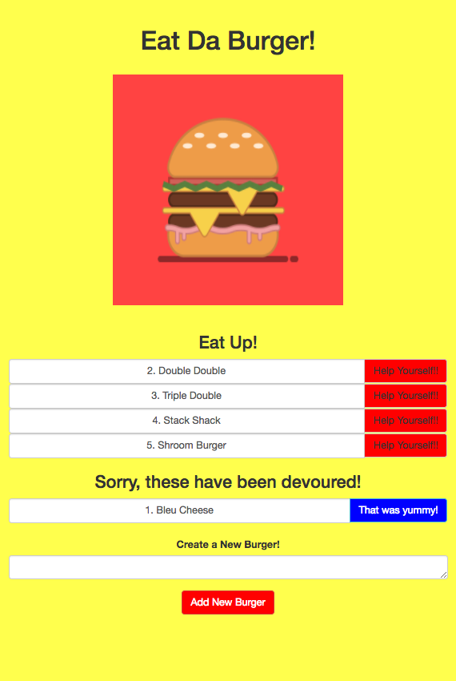

Eat Da Burger

An application that allows users to create, log and devour custom made burgers.  The enclosed application is built using MySQL, Node, Express, Handlebars, Method Override, Body-Parser and an ORM while following an Model View Controller (MVC) design.  

The final application has been deployed through Heroku and can be accessed with the following link: https://sleepy-shelf-86331.herokuapp.com/

Below is a screenshot of the application's UI on a desktop:

Below is a screenshot of the application's UI on a mobile device:

